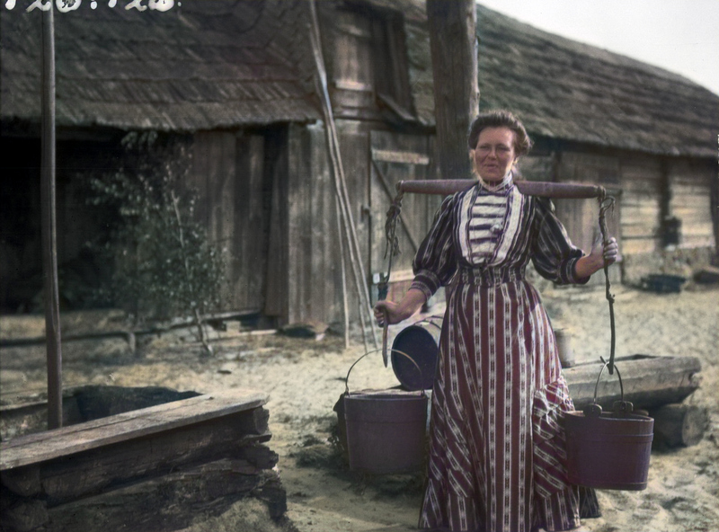
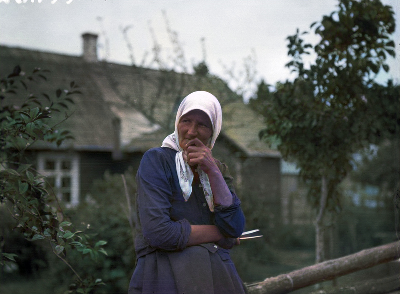
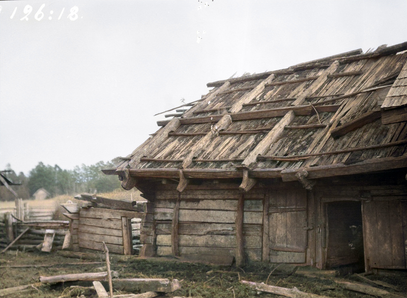
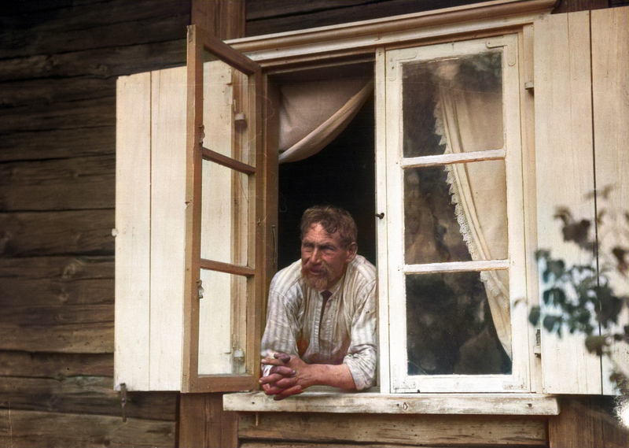
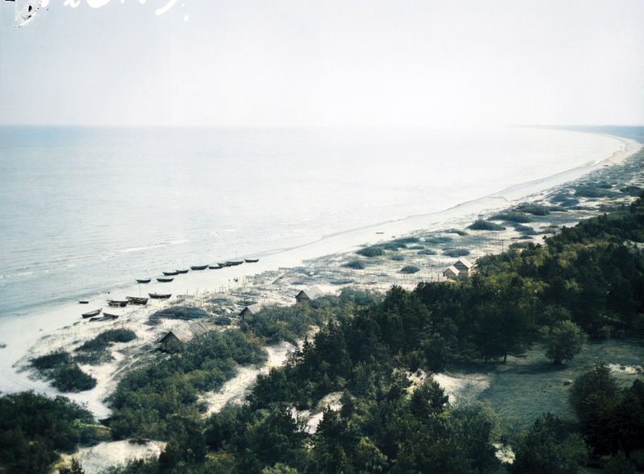

# Colorized Livonian Coast

[Click here for more information](README.md)

----

"Annõ Rottenberg ja oviaukosta kurkkivia lapsia"
| [More information](https://finna.fi/Record/museovirasto.03ED5E84F23006ADD9CCBE87AE55CB86?lng=en-gb) | [black-and-white original](https://www.finna.fi/Cover/Show?id=museovirasto.03ED5E84F23006ADD9CCBE87AE55CB86&index=0&size=large&source=Solr)

Photo by Vilho Setälä
| Published under a [CC BY 4.0 license](http://creativecommons.org/licenses/by/4.0/deed.en)

----

"75-vuotias Andrõks Rosenfelt"
| [More information](https://finna.fi/Record/museovirasto.08A3B65A4D7E0116FAE52F07BB6CD4A2?lng=en-gb) | [black-and-white original](https://www.finna.fi/Cover/Show?id=museovirasto.08A3B65A4D7E0116FAE52F07BB6CD4A2&index=0&size=large&source=Solr)

Photo by Vilho Setälä
| Published under a [CC BY 4.0 license](http://creativecommons.org/licenses/by/4.0/deed.en)

----

"Andrei Ermanbrik, Kristina ja Artur talon portailla"
| [More information](https://finna.fi/Record/museovirasto.16FC00C5EF0122CC37F2C7187BDB67DC?lng=en-gb) | [black-and-white original](https://www.finna.fi/Cover/Show?id=museovirasto.16FC00C5EF0122CC37F2C7187BDB67DC&index=0&size=large&source=Solr)

Photo by Vilho Setälä
| Published under a [CC BY 4.0 license](http://creativecommons.org/licenses/by/4.0/deed.en)

----

"halkoja lastataan mereen ajetuista kärryistä veneisiin"
| [More information](https://finna.fi/Record/museovirasto.21AAA9D605EDCABFD5EC7644A69B85C8?lng=en-gb) | [black-and-white original](https://www.finna.fi/Cover/Show?id=museovirasto.21AAA9D605EDCABFD5EC7644A69B85C8&index=0&size=large&source=Solr)

Photo by Vilho Setälä
| Published under a [CC BY 4.0 license](http://creativecommons.org/licenses/by/4.0/deed.en)

----

"vanhat yhden hevosen rattaat"
| [More information](https://finna.fi/Record/museovirasto.2A7930C0C97420D036E3BB6851F8E906?lng=en-gb) | [black-and-white original](https://www.finna.fi/Cover/Show?id=museovirasto.2A7930C0C97420D036E3BB6851F8E906&index=0&size=large&source=Solr)

Photo by Vilho Setälä
| Published under a [CC BY 4.0 license](http://creativecommons.org/licenses/by/4.0/deed.en)

----

"Ditš Belts hankoauran kurjessa"
| [More information](https://finna.fi/Record/museovirasto.31D098EEFB915963EDE56C7D977EE3BB?lng=en-gb) | [black-and-white original](https://www.finna.fi/Cover/Show?id=museovirasto.31D098EEFB915963EDE56C7D977EE3BB&index=0&size=large&source=Solr)

Photo by Vilho Setälä
| Published under a [CC BY 4.0 license](http://creativecommons.org/licenses/by/4.0/deed.en)

----

"kahden hevosen rattaat"
| [More information](https://finna.fi/Record/museovirasto.3DAC7BDC6231B674580EC90FD6F02A99?lng=en-gb) | [black-and-white original](https://www.finna.fi/Cover/Show?id=museovirasto.3DAC7BDC6231B674580EC90FD6F02A99&index=0&size=large&source=Solr)

Photo by Vilho Setälä
| Published under a [CC BY 4.0 license](http://creativecommons.org/licenses/by/4.0/deed.en)

----

"kattohaikaroiden eli tuonenkurkien pesä"
| [More information](https://finna.fi/Record/museovirasto.45273D12EAB76611471ACA7105037E3F?lng=en-gb) | [black-and-white original](https://www.finna.fi/Cover/Show?id=museovirasto.45273D12EAB76611471ACA7105037E3F&index=0&size=large&source=Solr)

Photo by Vilho Setälä
| Published under a [CC BY 4.0 license](http://creativecommons.org/licenses/by/4.0/deed.en)

----

"tulikota, jonka seinustalla on pyykkikaukalo"
| [More information](https://finna.fi/Record/museovirasto.48762DF7C14E3E2A8223C99F02495C5C?lng=en-gb) | [black-and-white original](https://www.finna.fi/Cover/Show?id=museovirasto.48762DF7C14E3E2A8223C99F02495C5C&index=0&size=large&source=Solr)

Photo by Vilho Setälä
| Published under a [CC BY 4.0 license](http://creativecommons.org/licenses/by/4.0/deed.en)

----

"kotá eli kuvdá, keittopata(?)"
| [More information](https://finna.fi/Record/museovirasto.50F97DAAEE57A5623AAE67647B9BBD82?lng=en-gb) | [black-and-white original](https://www.finna.fi/Cover/Show?id=museovirasto.50F97DAAEE57A5623AAE67647B9BBD82&index=0&size=large&source=Solr)

Photo by Vilho Setälä
| Published under a [CC BY 4.0 license](http://creativecommons.org/licenses/by/4.0/deed.en)

----

"Nikolai ja Līž Pietok"
| [More information](https://finna.fi/Record/museovirasto.5ABC0C6336437617299E8AA033DC01E6?lng=en-gb) | [black-and-white original](https://www.finna.fi/Cover/Show?id=museovirasto.5ABC0C6336437617299E8AA033DC01E6&index=0&size=large&source=Solr)

Photo by Vilho Setälä
| Published under a [CC BY 4.0 license](http://creativecommons.org/licenses/by/4.0/deed.en)

----

"Prinzin talon sauna"
| [More information](https://finna.fi/Record/museovirasto.6899CBF8440363465012B4EC88C8D545?lng=en-gb) | [black-and-white original](https://www.finna.fi/Cover/Show?id=museovirasto.6899CBF8440363465012B4EC88C8D545&index=0&size=large&source=Solr)

Photo by Vilho Setälä
| Published under a [CC BY 4.0 license](http://creativecommons.org/licenses/by/4.0/deed.en)

----

"pärekattoinen aitta"
| [More information](https://finna.fi/Record/museovirasto.727522A900462322DD1B294DF15905AD?lng=en-gb) | [black-and-white original](https://www.finna.fi/Cover/Show?id=museovirasto.727522A900462322DD1B294DF15905AD&index=0&size=large&source=Solr)

Photo by Vilho Setälä
| Published under a [CC BY 4.0 license](http://creativecommons.org/licenses/by/4.0/deed.en)

----

"Ditš Damberg kalastusasussa, ilman esiliinaa"
| [More information](https://finna.fi/Record/museovirasto.831839C773CF3F0D462A4B16B0B25488?lng=en-gb) | [black-and-white original](https://www.finna.fi/Cover/Show?id=museovirasto.831839C773CF3F0D462A4B16B0B25488&index=0&size=large&source=Solr)

Photo by Vilho Setälä
| Published under a [CC BY 4.0 license](http://creativecommons.org/licenses/by/4.0/deed.en)

----

"nainen suolaa perattuja kampeloita"
| [More information](https://finna.fi/Record/museovirasto.867FA19AF773C3DFDC65572F5ED82F51?lng=en-gb) | [black-and-white original](https://www.finna.fi/Cover/Show?id=museovirasto.867FA19AF773C3DFDC65572F5ED82F51&index=0&size=large&source=Solr)

Photo by Vilho Setälä
| Published under a [CC BY 4.0 license](http://creativecommons.org/licenses/by/4.0/deed.en)

----

"Mari Anbaug"
| [More information](https://finna.fi/Record/museovirasto.8904817F88BFA8B5B19D7BD8BB7DD712?lng=en-gb) | [black-and-white original](https://www.finna.fi/Cover/Show?id=museovirasto.8904817F88BFA8B5B19D7BD8BB7DD712&index=0&size=large&source=Solr)

Photo by Vilho Setälä
| Published under a [CC BY 4.0 license](http://creativecommons.org/licenses/by/4.0/deed.en)

----

"kampeloiden pesuun käytettäviä työvälineitä"
| [More information](https://finna.fi/Record/museovirasto.8BF0C9239290B2BA225C8D4AED54495A?lng=en-gb) | [black-and-white original](https://www.finna.fi/Cover/Show?id=museovirasto.8BF0C9239290B2BA225C8D4AED54495A&index=0&size=large&source=Solr)

Photo by Vilho Setälä
| Published under a [CC BY 4.0 license](http://creativecommons.org/licenses/by/4.0/deed.en)

----

"kaksi puista kelaa"
| [More information](https://finna.fi/Record/museovirasto.99C3FDC761EBAD842FB831B45791D863?lng=en-gb) | [black-and-white original](https://www.finna.fi/Cover/Show?id=museovirasto.99C3FDC761EBAD842FB831B45791D863&index=0&size=large&source=Solr)

Photo by Vilho Setälä
| Published under a [CC BY 4.0 license](http://creativecommons.org/licenses/by/4.0/deed.en)

----

"savupirtin kiuas"
| [More information](https://finna.fi/Record/museovirasto.A62E32775E438C7D7E8DD7C5AD978C7E?lng=en-gb) | [black-and-white original](https://www.finna.fi/Cover/Show?id=museovirasto.A62E32775E438C7D7E8DD7C5AD978C7E&index=0&size=large&source=Solr)

Photo by Vilho Setälä
| Published under a [CC BY 4.0 license](http://creativecommons.org/licenses/by/4.0/deed.en)

----

"Līž Val't vanhassa morsiuspuvussa"
| [More information](https://finna.fi/Record/museovirasto.AE1BC490A83BA03585A221036C44C0CE?lng=en-gb) | [black-and-white original](https://www.finna.fi/Cover/Show?id=museovirasto.AE1BC490A83BA03585A221036C44C0CE&index=0&size=large&source=Solr)

Photo by Vilho Setälä
| Published under a [CC BY 4.0 license](http://creativecommons.org/licenses/by/4.0/deed.en)

----

"autioitunut asumus, johon kuuluvat aitta, tupa, eteinen ja talli"
| [More information](https://finna.fi/Record/museovirasto.BAD975A85C0F7341EB105C234C0BE57F?lng=en-gb) | [black-and-white original](https://www.finna.fi/Cover/Show?id=museovirasto.BAD975A85C0F7341EB105C234C0BE57F&index=0&size=large&source=Solr)

Photo by Vilho Setälä
| Published under a [CC BY 4.0 license](http://creativecommons.org/licenses/by/4.0/deed.en)

----

"tuvan ja eteisen käsittävä Vigan talo"
| [More information](https://finna.fi/Record/museovirasto.C157A5CBD6CE2BD907825439B592AC59?lng=en-gb) | [black-and-white original](https://www.finna.fi/Cover/Show?id=museovirasto.C157A5CBD6CE2BD907825439B592AC59&index=0&size=large&source=Solr)

Photo by Vilho Setälä
| Published under a [CC BY 4.0 license](http://creativecommons.org/licenses/by/4.0/deed.en)

----

"tuulimylly"
| [More information](https://finna.fi/Record/museovirasto.C703F7B808733AC83EBED1D08BBFB3EE?lng=en-gb) | [black-and-white original](https://www.finna.fi/Cover/Show?id=museovirasto.C703F7B808733AC83EBED1D08BBFB3EE&index=0&size=large&source=Solr)

Photo by Vilho Setälä
| Published under a [CC BY 4.0 license](http://creativecommons.org/licenses/by/4.0/deed.en)

----

"ranta-aitta"
| [More information](https://finna.fi/Record/museovirasto.D453EE753CE88D973E50AC38811E03E6?lng=en-gb) | [black-and-white original](https://www.finna.fi/Cover/Show?id=museovirasto.D453EE753CE88D973E50AC38811E03E6&index=0&size=large&source=Solr)

Photo by Vilho Setälä
| Published under a [CC BY 4.0 license](http://creativecommons.org/licenses/by/4.0/deed.en)

----

"Jan Ernetovskij, professori Setälän kielimestari"
| [More information](https://finna.fi/Record/museovirasto.F0292F4C433A306D45579219BBACFABF?lng=en-gb) | [black-and-white original](https://www.finna.fi/Cover/Show?id=museovirasto.F0292F4C433A306D45579219BBACFABF&index=0&size=large&source=Solr)

Photo by Vilho Setälä
| Published under a [CC BY 4.0 license](http://creativecommons.org/licenses/by/4.0/deed.en)

----

"käsikivet"
| [More information](https://finna.fi/Record/museovirasto.F1C5DD023EF1843511F7ADF6ABFA6AD1?lng=en-gb) | [black-and-white original](https://www.finna.fi/Cover/Show?id=museovirasto.F1C5DD023EF1843511F7ADF6ABFA6AD1&index=0&size=large&source=Solr)

Photo by Vilho Setälä
| Published under a [CC BY 4.0 license](http://creativecommons.org/licenses/by/4.0/deed.en)

----

"Fritz Kleiberg kalastajanpuvussa"
| [More information](https://finna.fi/Record/museovirasto.FD48F322681AB5EBF1EABA959E5D2BA0?lng=en-gb) | [black-and-white original](https://www.finna.fi/Cover/Show?id=museovirasto.FD48F322681AB5EBF1EABA959E5D2BA0&index=0&size=large&source=Solr)

Photo by Vilho Setälä
| Published under a [CC BY 4.0 license](http://creativecommons.org/licenses/by/4.0/deed.en)

----

"Adamsonin perhe"
| [More information](https://finna.fi/Record/museovirasto.03FCB4866A2313D6F666A04CDFCCDCBC?lng=en-gb) | [black-and-white original](https://www.finna.fi/Cover/Show?id=museovirasto.03FCB4866A2313D6F666A04CDFCCDCBC&index=0&size=large&source=Solr)

Photo by Vilho Setälä
| Published under a [CC BY 4.0 license](http://creativecommons.org/licenses/by/4.0/deed.en)

----

"Kristin Demborg kantamassa vesisankoja ämmänlängillä"
| [More information](https://finna.fi/Record/museovirasto.0BD7FF9985B88A750B0080706EE12DFF?lng=en-gb) | [black-and-white original](https://www.finna.fi/Cover/Show?id=museovirasto.0BD7FF9985B88A750B0080706EE12DFF&index=0&size=large&source=Solr)

Photo by Vilho Setälä
| Published under a [CC BY 4.0 license](http://creativecommons.org/licenses/by/4.0/deed.en)

----

"Prinzin talon tytär Līna Walt tyttärineen"
| [More information](https://finna.fi/Record/museovirasto.1918BE42884C3086879D3E078A9857D9?lng=en-gb) | [black-and-white original](https://www.finna.fi/Cover/Show?id=museovirasto.1918BE42884C3086879D3E078A9857D9&index=0&size=large&source=Solr)

Photo by Vilho Setälä
| Published under a [CC BY 4.0 license](http://creativecommons.org/licenses/by/4.0/deed.en)

----

"kalastusvene kuivaa purjeitaan rannalla"
| [More information](https://finna.fi/Record/museovirasto.23C60354AA5B0669375B952682B06592?lng=en-gb) | [black-and-white original](https://www.finna.fi/Cover/Show?id=museovirasto.23C60354AA5B0669375B952682B06592&index=0&size=large&source=Solr)

Photo by Vilho Setälä
| Published under a [CC BY 4.0 license](http://creativecommons.org/licenses/by/4.0/deed.en)

----

"tutkimusryhmän matkatavaroita kuljetetaan hevoskyydillä Iiraan"
| [More information](https://finna.fi/Record/museovirasto.28F6ECE91151F01A4EA6F10F0A48D83B?lng=en-gb) | [black-and-white original](https://www.finna.fi/Cover/Show?id=museovirasto.28F6ECE91151F01A4EA6F10F0A48D83B&index=0&size=large&source=Solr)

Photo by Vilho Setälä
| Published under a [CC BY 4.0 license](http://creativecommons.org/licenses/by/4.0/deed.en)

----

"rantamaisema"
| [More information](https://finna.fi/Record/museovirasto.4569A72DF5A97872A661C5D549AB7EDA?lng=en-gb) | [black-and-white original](https://www.finna.fi/Cover/Show?id=museovirasto.4569A72DF5A97872A661C5D549AB7EDA&index=0&size=large&source=Solr)

Photo by Vilho Setälä
| Published under a [CC BY 4.0 license](http://creativecommons.org/licenses/by/4.0/deed.en)

----

"asuinrakennus"
| [More information](https://finna.fi/Record/museovirasto.4ED5FB537E45B25154226CAAE97E012D?lng=en-gb) | [black-and-white original](https://www.finna.fi/Cover/Show?id=museovirasto.4ED5FB537E45B25154226CAAE97E012D&index=0&size=large&source=Solr)

Photo by Vilho Setälä
| Published under a [CC BY 4.0 license](http://creativecommons.org/licenses/by/4.0/deed.en)

----

"kalastusverkkojen vapeita rannalla"
| [More information](https://finna.fi/Record/museovirasto.568AAD2187C593FD8E835926074EFCA4?lng=en-gb) | [black-and-white original](https://www.finna.fi/Cover/Show?id=museovirasto.568AAD2187C593FD8E835926074EFCA4&index=0&size=large&source=Solr)

Photo by Vilho Setälä
| Published under a [CC BY 4.0 license](http://creativecommons.org/licenses/by/4.0/deed.en)

----

"Kersti Volganskij ja hänen poikansa, tyttärensä sekä tyttärenpoikansa"
| [More information](https://finna.fi/Record/museovirasto.6E0C033BE11BA8E71E31514D827A2FBB?lng=en-gb) | [black-and-white original](https://www.finna.fi/Cover/Show?id=museovirasto.6E0C033BE11BA8E71E31514D827A2FBB&index=0&size=large&source=Solr)

Photo by Vilho Setälä
| Published under a [CC BY 4.0 license](http://creativecommons.org/licenses/by/4.0/deed.en)

----

"kalastusvene saapumassa rantaan"
| [More information](https://finna.fi/Record/museovirasto.82394856FEA496829470DD67A6FD0411?lng=en-gb) | [black-and-white original](https://www.finna.fi/Cover/Show?id=museovirasto.82394856FEA496829470DD67A6FD0411&index=0&size=large&source=Solr)

Photo by Vilho Setälä
| Published under a [CC BY 4.0 license](http://creativecommons.org/licenses/by/4.0/deed.en)

----

"kalanperkausta kalastusveneiden luona"
| [More information](https://finna.fi/Record/museovirasto.85FFED2DC59ACEEC72E76B885E7E8E25?lng=en-gb) | [black-and-white original](https://www.finna.fi/Cover/Show?id=museovirasto.85FFED2DC59ACEEC72E76B885E7E8E25&index=0&size=large&source=Solr)

Photo by Vilho Setälä
| Published under a [CC BY 4.0 license](http://creativecommons.org/licenses/by/4.0/deed.en)

----

"Drõudzinin talo"
| [More information](https://finna.fi/Record/museovirasto.916C90FF9F90C64652BBBF71FFA578F3?lng=en-gb) | [black-and-white original](https://www.finna.fi/Cover/Show?id=museovirasto.916C90FF9F90C64652BBBF71FFA578F3&index=0&size=large&source=Solr)

Photo by Vilho Setälä
| Published under a [CC BY 4.0 license](http://creativecommons.org/licenses/by/4.0/deed.en)

----

"mies ja nainen perkaamassa kaloja"
| [More information](https://finna.fi/Record/museovirasto.9FF38CB78F309042ECF716C01172C2D7?lng=en-gb) | [black-and-white original](https://www.finna.fi/Cover/Show?id=museovirasto.9FF38CB78F309042ECF716C01172C2D7&index=0&size=large&source=Solr)

Photo by Vilho Setälä
| Published under a [CC BY 4.0 license](http://creativecommons.org/licenses/by/4.0/deed.en)

----

"rantamaisema"
| [More information](https://finna.fi/Record/museovirasto.A39862D22F256B905D670243B1CE6655?lng=en-gb) | [black-and-white original](https://www.finna.fi/Cover/Show?id=museovirasto.A39862D22F256B905D670243B1CE6655&index=0&size=large&source=Solr)

Photo by Vilho Setälä
| Published under a [CC BY 4.0 license](http://creativecommons.org/licenses/by/4.0/deed.en)

----

"veneenhylystä rakennettu kota"
| [More information](https://finna.fi/Record/museovirasto.A490AF9209411E95CD24148A9D3861F5?lng=en-gb) | [black-and-white original](https://www.finna.fi/Cover/Show?id=museovirasto.A490AF9209411E95CD24148A9D3861F5&index=0&size=large&source=Solr)

Photo by Vilho Setälä
| Published under a [CC BY 4.0 license](http://creativecommons.org/licenses/by/4.0/deed.en)

----

"liiviläisvanhus Dietrich Belt"
| [More information](https://finna.fi/Record/museovirasto.AE76132A4BF1306E3480F633F4C3DCB2?lng=en-gb) | [black-and-white original](https://www.finna.fi/Cover/Show?id=museovirasto.AE76132A4BF1306E3480F633F4C3DCB2&index=0&size=large&source=Solr)

Photo by Vilho Setälä
| Published under a [CC BY 4.0 license](http://creativecommons.org/licenses/by/4.0/deed.en)

----

"89-vuotias Andrõks Hausman"
| [More information](https://finna.fi/Record/museovirasto.D5069508C3AB1122FADF0A2227798097?lng=en-gb) | [black-and-white original](https://www.finna.fi/Cover/Show?id=museovirasto.D5069508C3AB1122FADF0A2227798097&index=0&size=large&source=Solr)

Photo by Vilho Setälä
| Published under a [CC BY 4.0 license](http://creativecommons.org/licenses/by/4.0/deed.en)

----

"kiuas ja koukut"
| [More information](https://finna.fi/Record/museovirasto.D983F9F2C178B32CFB72129898677483?lng=en-gb) | [black-and-white original](https://www.finna.fi/Cover/Show?id=museovirasto.D983F9F2C178B32CFB72129898677483&index=0&size=large&source=Solr)

Photo by Vilho Setälä
| Published under a [CC BY 4.0 license](http://creativecommons.org/licenses/by/4.0/deed.en)

----

"kalastusvene saapumassa rantaan"
| [More information](https://finna.fi/Record/museovirasto.E4C04D17B9D8BFA794A6D050AEF7080A?lng=en-gb) | [black-and-white original](https://www.finna.fi/Cover/Show?id=museovirasto.E4C04D17B9D8BFA794A6D050AEF7080A&index=0&size=large&source=Solr)

Photo by Vilho Setälä
| Published under a [CC BY 4.0 license](http://creativecommons.org/licenses/by/4.0/deed.en)

----

"Aleks Ollman, Lina Sults ja Jani Daambo käyttävät köydenpunontakonetta"
| [More information](https://finna.fi/Record/museovirasto.07CB6A38F3F5EDA35D68E47416D66FB6?lng=en-gb) | [black-and-white original](https://www.finna.fi/Cover/Show?id=museovirasto.07CB6A38F3F5EDA35D68E47416D66FB6&index=0&size=large&source=Solr)

Photo by Vilho Setälä
| Published under a [CC BY 4.0 license](http://creativecommons.org/licenses/by/4.0/deed.en)

----

"veneenhylystä tehty maja"
| [More information](https://finna.fi/Record/museovirasto.0F30C20720D241081FAF6559B68E3B3B?lng=en-gb) | [black-and-white original](https://www.finna.fi/Cover/Show?id=museovirasto.0F30C20720D241081FAF6559B68E3B3B&index=0&size=large&source=Solr)

Photo by Vilho Setälä
| Published under a [CC BY 4.0 license](http://creativecommons.org/licenses/by/4.0/deed.en)

----

"rantamaisema"
| [More information](https://finna.fi/Record/museovirasto.124C29E29A6850F1DA40121D3063D0B0?lng=en-gb) | [black-and-white original](https://www.finna.fi/Cover/Show?id=museovirasto.124C29E29A6850F1DA40121D3063D0B0&index=0&size=large&source=Solr)

Photo by Vilho Setälä
| Published under a [CC BY 4.0 license](http://creativecommons.org/licenses/by/4.0/deed.en)

----

"entisen ranta-aitan vanhat ovet"
| [More information](https://finna.fi/Record/museovirasto.13BBFF57B01605DF72AF90CDB633372C?lng=en-gb) | [black-and-white original](https://www.finna.fi/Cover/Show?id=museovirasto.13BBFF57B01605DF72AF90CDB633372C&index=0&size=large&source=Solr)

Photo by Vilho Setälä
| Published under a [CC BY 4.0 license](http://creativecommons.org/licenses/by/4.0/deed.en)

----

"nuottanuorat kuivumassa telineillä"
| [More information](https://finna.fi/Record/museovirasto.14202E1712E712A09583F928075AA209?lng=en-gb) | [black-and-white original](https://www.finna.fi/Cover/Show?id=museovirasto.14202E1712E712A09583F928075AA209&index=0&size=large&source=Solr)

Photo by Vilho Setälä
| Published under a [CC BY 4.0 license](http://creativecommons.org/licenses/by/4.0/deed.en)

----

"miehet punomassa köyttä"
| [More information](https://finna.fi/Record/museovirasto.3BBD5AA134EF8E72C6BEE70D1E5D508F?lng=en-gb) | [black-and-white original](https://www.finna.fi/Cover/Show?id=museovirasto.3BBD5AA134EF8E72C6BEE70D1E5D508F&index=0&size=large&source=Solr)

Photo by Vilho Setälä
| Published under a [CC BY 4.0 license](http://creativecommons.org/licenses/by/4.0/deed.en)

----

"työkaluja"
| [More information](https://finna.fi/Record/museovirasto.3E49612DC08245830EAA7ED121E2A758?lng=en-gb) | [black-and-white original](https://www.finna.fi/Cover/Show?id=museovirasto.3E49612DC08245830EAA7ED121E2A758&index=0&size=large&source=Solr)

Photo by Vilho Setälä
| Published under a [CC BY 4.0 license](http://creativecommons.org/licenses/by/4.0/deed.en)

----

"Trīn Freiberg vanhassa morsiuspuvussaan"
| [More information](https://finna.fi/Record/museovirasto.409F1E30E18CF432C652F16BCFDD7BC9?lng=en-gb) | [black-and-white original](https://www.finna.fi/Cover/Show?id=museovirasto.409F1E30E18CF432C652F16BCFDD7BC9&index=0&size=large&source=Solr)

Photo by Vilho Setälä
| Published under a [CC BY 4.0 license](http://creativecommons.org/licenses/by/4.0/deed.en)

----

"katos verkonmerkkien säilytykseen"
| [More information](https://finna.fi/Record/museovirasto.4224AC214C277F3D10FA7ACBEE308BA9?lng=en-gb) | [black-and-white original](https://www.finna.fi/Cover/Show?id=museovirasto.4224AC214C277F3D10FA7ACBEE308BA9&index=0&size=large&source=Solr)

Photo by Vilho Setälä
| Published under a [CC BY 4.0 license](http://creativecommons.org/licenses/by/4.0/deed.en)

----

"hyljekeihään kärkiä, nahkalapikkaiden paikkuuvälineet ja niihin kuuluva tuppi"
| [More information](https://finna.fi/Record/museovirasto.6CD18985A3EBBDC082088FEFC60F5E1A?lng=en-gb) | [black-and-white original](https://www.finna.fi/Cover/Show?id=museovirasto.6CD18985A3EBBDC082088FEFC60F5E1A&index=0&size=large&source=Solr)

Photo by Vilho Setälä
| Published under a [CC BY 4.0 license](http://creativecommons.org/licenses/by/4.0/deed.en)

----

"Mari Jakadals ja hänen tyttärensä Elsa Kron"
| [More information](https://finna.fi/Record/museovirasto.6CF19764E422C0560669AE85AAB318F0?lng=en-gb) | [black-and-white original](https://www.finna.fi/Cover/Show?id=museovirasto.6CF19764E422C0560669AE85AAB318F0&index=0&size=large&source=Solr)

Photo by Vilho Setälä
| Published under a [CC BY 4.0 license](http://creativecommons.org/licenses/by/4.0/deed.en)

----

"kampelasaalista lasketaan"
| [More information](https://finna.fi/Record/museovirasto.8B8902EBAF564C323E1049702CB8235C?lng=en-gb) | [black-and-white original](https://www.finna.fi/Cover/Show?id=museovirasto.8B8902EBAF564C323E1049702CB8235C&index=0&size=large&source=Solr)

Photo by Vilho Setälä
| Published under a [CC BY 4.0 license](http://creativecommons.org/licenses/by/4.0/deed.en)

----

"mehiläiskeko parveiluaikaan"
| [More information](https://finna.fi/Record/museovirasto.99BF97C1ADA23B0F2318C0ACC4499B0C?lng=en-gb) | [black-and-white original](https://www.finna.fi/Cover/Show?id=museovirasto.99BF97C1ADA23B0F2318C0ACC4499B0C&index=0&size=large&source=Solr)

Photo by Vilho Setälä
| Published under a [CC BY 4.0 license](http://creativecommons.org/licenses/by/4.0/deed.en)

----

"kolme kuvioitua kudottua peittoa"
| [More information](https://finna.fi/Record/museovirasto.A4258684491D1ADC9F86EC323E664DDE?lng=en-gb) | [black-and-white original](https://www.finna.fi/Cover/Show?id=museovirasto.A4258684491D1ADC9F86EC323E664DDE&index=0&size=large&source=Solr)

Photo by Vilho Setälä
| Published under a [CC BY 4.0 license](http://creativecommons.org/licenses/by/4.0/deed.en)

----

"Viktoria Adamkovitš"
| [More information](https://finna.fi/Record/museovirasto.AB6FD72BBD4D19D6923CB961C7972EC0?lng=en-gb) | [black-and-white original](https://www.finna.fi/Cover/Show?id=museovirasto.AB6FD72BBD4D19D6923CB961C7972EC0&index=0&size=large&source=Solr)

Photo by Vilho Setälä
| Published under a [CC BY 4.0 license](http://creativecommons.org/licenses/by/4.0/deed.en)

----

"lusikkateline tuvan ulkoseinällä"
| [More information](https://finna.fi/Record/museovirasto.B59086D5A37DC3AF1141A086E6690B26?lng=en-gb) | [black-and-white original](https://www.finna.fi/Cover/Show?id=museovirasto.B59086D5A37DC3AF1141A086E6690B26&index=0&size=large&source=Solr)

Photo by Vilho Setälä
| Published under a [CC BY 4.0 license](http://creativecommons.org/licenses/by/4.0/deed.en)

----

"mehiläispönttöjä mehiläistarhassa"
| [More information](https://finna.fi/Record/museovirasto.C2260CEBBFF82E1C63F85F3EB974B9E4?lng=en-gb) | [black-and-white original](https://www.finna.fi/Cover/Show?id=museovirasto.C2260CEBBFF82E1C63F85F3EB974B9E4&index=0&size=large&source=Solr)

Photo by Vilho Setälä
| Published under a [CC BY 4.0 license](http://creativecommons.org/licenses/by/4.0/deed.en)

----

"navetta"
| [More information](https://finna.fi/Record/museovirasto.CF9EA6ACAEEAD10D43EF529A71C3C3F0?lng=en-gb) | [black-and-white original](https://www.finna.fi/Cover/Show?id=museovirasto.CF9EA6ACAEEAD10D43EF529A71C3C3F0&index=0&size=large&source=Solr)

Photo by Vilho Setälä
| Published under a [CC BY 4.0 license](http://creativecommons.org/licenses/by/4.0/deed.en)

----

"liiviläinen nainen heinätöissä"
| [More information](https://finna.fi/Record/museovirasto.D93F3EECF51ED405647CD29878E948E9?lng=en-gb) | [black-and-white original](https://www.finna.fi/Cover/Show?id=museovirasto.D93F3EECF51ED405647CD29878E948E9&index=0&size=large&source=Solr)

Photo by Vilho Setälä
| Published under a [CC BY 4.0 license](http://creativecommons.org/licenses/by/4.0/deed.en)

----

"August Dišler"
| [More information](https://finna.fi/Record/museovirasto.E4324C8789A3FA3630F262B5ED5E9D54?lng=en-gb) | [black-and-white original](https://www.finna.fi/Cover/Show?id=museovirasto.E4324C8789A3FA3630F262B5ED5E9D54&index=0&size=large&source=Solr)

Photo by Vilho Setälä
| Published under a [CC BY 4.0 license](http://creativecommons.org/licenses/by/4.0/deed.en)

----

"hiekkadyyni"
| [More information](https://finna.fi/Record/museovirasto.E7AE0E1E86081B0FD90901798D2801CB?lng=en-gb) | [black-and-white original](https://www.finna.fi/Cover/Show?id=museovirasto.E7AE0E1E86081B0FD90901798D2801CB&index=0&size=large&source=Solr)

Photo by Vilho Setälä
| Published under a [CC BY 4.0 license](http://creativecommons.org/licenses/by/4.0/deed.en)

----

"Jani Rosenfeld vaimonsa ja lapsiensa kanssa"
| [More information](https://finna.fi/Record/museovirasto.EB462A0959F0535286FBB8EBD4459C17?lng=en-gb) | [black-and-white original](https://www.finna.fi/Cover/Show?id=museovirasto.EB462A0959F0535286FBB8EBD4459C17&index=0&size=large&source=Solr)

Photo by Vilho Setälä
| Published under a [CC BY 4.0 license](http://creativecommons.org/licenses/by/4.0/deed.en)

----

"puisia mehiläispönttöjä mehiläistarhassa"
| [More information](https://finna.fi/Record/museovirasto.F0F39CEDD65EF831AFC4DCF40EE50329?lng=en-gb) | [black-and-white original](https://www.finna.fi/Cover/Show?id=museovirasto.F0F39CEDD65EF831AFC4DCF40EE50329&index=0&size=large&source=Solr)

Photo by Vilho Setälä
| Published under a [CC BY 4.0 license](http://creativecommons.org/licenses/by/4.0/deed.en)

----

"Triõnõ Jei, 65-vuotias liiviläisnainen"
| [More information](https://finna.fi/Record/museovirasto.F58B0E0B62FE1A567280E89F0C15614E?lng=en-gb) | [black-and-white original](https://www.finna.fi/Cover/Show?id=museovirasto.F58B0E0B62FE1A567280E89F0C15614E&index=0&size=large&source=Solr)

Photo by Vilho Setälä
| Published under a [CC BY 4.0 license](http://creativecommons.org/licenses/by/4.0/deed.en)

----

"Jani Krišan tervaa kärrynpyöriä Drõudzinin talossa"
| [More information](https://finna.fi/Record/museovirasto.FBFE83EDA69832A6279F4265AD86560A?lng=en-gb) | [black-and-white original](https://www.finna.fi/Cover/Show?id=museovirasto.FBFE83EDA69832A6279F4265AD86560A&index=0&size=large&source=Solr)

Photo by Vilho Setälä
| Published under a [CC BY 4.0 license](http://creativecommons.org/licenses/by/4.0/deed.en)

----

"mustanummilaisia miehiä vanhan linnan sijaintipaikalla"
| [More information](https://finna.fi/Record/museovirasto.025EC5511B4EBA202F108FE8A8AA4219?lng=en-gb) | [black-and-white original](https://www.finna.fi/Cover/Show?id=museovirasto.025EC5511B4EBA202F108FE8A8AA4219&index=0&size=large&source=Solr)

Photo by Vilho Setälä
| Published under a [CC BY 4.0 license](http://creativecommons.org/licenses/by/4.0/deed.en)

----

"mies punomassa köyttä"
| [More information](https://finna.fi/Record/museovirasto.04A64E88FA1988F729F0E835811BDB7B?lng=en-gb) | [black-and-white original](https://www.finna.fi/Cover/Show?id=museovirasto.04A64E88FA1988F729F0E835811BDB7B&index=0&size=large&source=Solr)

Photo by Vilho Setälä
| Published under a [CC BY 4.0 license](http://creativecommons.org/licenses/by/4.0/deed.en)

----

"Anbaugin perhe"
| [More information](https://finna.fi/Record/museovirasto.0D746F1F642FF49A70C815C6E4EF4ADE?lng=en-gb) | [black-and-white original](https://www.finna.fi/Cover/Show?id=museovirasto.0D746F1F642FF49A70C815C6E4EF4ADE&index=0&size=large&source=Solr)

Photo by Vilho Setälä
| Published under a [CC BY 4.0 license](http://creativecommons.org/licenses/by/4.0/deed.en)

----

"kangaspuut"
| [More information](https://finna.fi/Record/museovirasto.1652D1067B2715408E594E5DAFF40858?lng=en-gb) | [black-and-white original](https://www.finna.fi/Cover/Show?id=museovirasto.1652D1067B2715408E594E5DAFF40858&index=0&size=large&source=Solr)

Photo by Vilho Setälä
| Published under a [CC BY 4.0 license](http://creativecommons.org/licenses/by/4.0/deed.en)

----

"Jānis Bertholds 9-vuotiaan pojanpoikansa Džems Bertholdsin kanssa"
| [More information](https://finna.fi/Record/museovirasto.2580177E5A8EEF2469ADF4210B85A491?lng=en-gb) | [black-and-white original](https://www.finna.fi/Cover/Show?id=museovirasto.2580177E5A8EEF2469ADF4210B85A491&index=0&size=large&source=Solr)

Photo by Vilho Setälä
| Published under a [CC BY 4.0 license](http://creativecommons.org/licenses/by/4.0/deed.en)

----

"Brjenkop vaimoineen"
| [More information](https://finna.fi/Record/museovirasto.31F00F8DADE4E51BF80268D4C3D5F966?lng=en-gb) | [black-and-white original](https://www.finna.fi/Cover/Show?id=museovirasto.31F00F8DADE4E51BF80268D4C3D5F966&index=0&size=large&source=Solr)

Photo by Vilho Setälä
| Published under a [CC BY 4.0 license](http://creativecommons.org/licenses/by/4.0/deed.en)

----

"aittarakennus"
| [More information](https://finna.fi/Record/museovirasto.34EDA043A2FCC3D10C5EAF69028B1593?lng=en-gb) | [black-and-white original](https://www.finna.fi/Cover/Show?id=museovirasto.34EDA043A2FCC3D10C5EAF69028B1593&index=0&size=large&source=Solr)

Photo by Vilho Setälä
| Published under a [CC BY 4.0 license](http://creativecommons.org/licenses/by/4.0/deed.en)

----

"Jain Belte ikkunassa"
| [More information](https://finna.fi/Record/museovirasto.3E3696D668434D68A3A48A406FF8D3FB?lng=en-gb) | [black-and-white original](https://www.finna.fi/Cover/Show?id=museovirasto.3E3696D668434D68A3A48A406FF8D3FB&index=0&size=large&source=Solr)

Photo by Vilho Setälä
| Published under a [CC BY 4.0 license](http://creativecommons.org/licenses/by/4.0/deed.en)

----

"talousrakennus"
| [More information](https://finna.fi/Record/museovirasto.3F649A0025237204123DF438A16C2635?lng=en-gb) | [black-and-white original](https://www.finna.fi/Cover/Show?id=museovirasto.3F649A0025237204123DF438A16C2635&index=0&size=large&source=Solr)

Photo by Vilho Setälä
| Published under a [CC BY 4.0 license](http://creativecommons.org/licenses/by/4.0/deed.en)

----

"merenvalkama"
| [More information](https://finna.fi/Record/museovirasto.4B73D8A5BE834F3F517E290E2A85621A?lng=en-gb) | [black-and-white original](https://www.finna.fi/Cover/Show?id=museovirasto.4B73D8A5BE834F3F517E290E2A85621A&index=0&size=large&source=Solr)

Photo by Vilho Setälä
| Published under a [CC BY 4.0 license](http://creativecommons.org/licenses/by/4.0/deed.en)

----

"liiviläismiehet Petš Didrikson ja Ditš eli Sidrõk Damberg"
| [More information](https://finna.fi/Record/museovirasto.555381731063CE2F951E2B4FDB184575?lng=en-gb) | [black-and-white original](https://www.finna.fi/Cover/Show?id=museovirasto.555381731063CE2F951E2B4FDB184575&index=0&size=large&source=Solr)

Photo by Vilho Setälä
| Published under a [CC BY 4.0 license](http://creativecommons.org/licenses/by/4.0/deed.en)

----

"Ditš Damberg kalastajan asussa"
| [More information](https://finna.fi/Record/museovirasto.571B2B3A534D70A8EFB2DCD9371E3AE8?lng=en-gb) | [black-and-white original](https://www.finna.fi/Cover/Show?id=museovirasto.571B2B3A534D70A8EFB2DCD9371E3AE8&index=0&size=large&source=Solr)

Photo by Vilho Setälä
| Published under a [CC BY 4.0 license](http://creativecommons.org/licenses/by/4.0/deed.en)

----

"Prinzin talon riihi"
| [More information](https://finna.fi/Record/museovirasto.5FF51D2E5308232C718345FB9FEC60E1?lng=en-gb) | [black-and-white original](https://www.finna.fi/Cover/Show?id=museovirasto.5FF51D2E5308232C718345FB9FEC60E1&index=0&size=large&source=Solr)

Photo by Vilho Setälä
| Published under a [CC BY 4.0 license](http://creativecommons.org/licenses/by/4.0/deed.en)

----

"miehet rakentamassa venettä"
| [More information](https://finna.fi/Record/museovirasto.7113651A25342CA73EA517EA9728DC36?lng=en-gb) | [black-and-white original](https://www.finna.fi/Cover/Show?id=museovirasto.7113651A25342CA73EA517EA9728DC36&index=0&size=large&source=Solr)

Photo by Vilho Setälä
| Published under a [CC BY 4.0 license](http://creativecommons.org/licenses/by/4.0/deed.en)

----

"77-vuotias liiviläismies Didrik Sandman"
| [More information](https://finna.fi/Record/museovirasto.85E444A764B51832FB28574862674416?lng=en-gb) | [black-and-white original](https://www.finna.fi/Cover/Show?id=museovirasto.85E444A764B51832FB28574862674416&index=0&size=large&source=Solr)

Photo by Vilho Setälä
| Published under a [CC BY 4.0 license](http://creativecommons.org/licenses/by/4.0/deed.en)

----

"näkymä Pizan majakasta merenvalkamaan"
| [More information](https://finna.fi/Record/museovirasto.871088232A502183E53A693C30CF078E?lng=en-gb) | [black-and-white original](https://www.finna.fi/Cover/Show?id=museovirasto.871088232A502183E53A693C30CF078E&index=0&size=large&source=Solr)

Photo by Vilho Setälä
| Published under a [CC BY 4.0 license](http://creativecommons.org/licenses/by/4.0/deed.en)

----

"miehet kantavat verkkoja veneestä rannalle"
| [More information](https://finna.fi/Record/museovirasto.8A8D01B94529270C67DA79553F6FFF13?lng=en-gb) | [black-and-white original](https://www.finna.fi/Cover/Show?id=museovirasto.8A8D01B94529270C67DA79553F6FFF13&index=0&size=large&source=Solr)

Photo by Vilho Setälä
| Published under a [CC BY 4.0 license](http://creativecommons.org/licenses/by/4.0/deed.en)

----

"80-vuotias Kloudž Hallman riisuu hevosta valjaista"
| [More information](https://finna.fi/Record/museovirasto.9A8EAB83CC4D0CB1C0431F63419E502B?lng=en-gb) | [black-and-white original](https://www.finna.fi/Cover/Show?id=museovirasto.9A8EAB83CC4D0CB1C0431F63419E502B&index=0&size=large&source=Solr)

Photo by Vilho Setälä
| Published under a [CC BY 4.0 license](http://creativecommons.org/licenses/by/4.0/deed.en)

----

"Indrok Kandõs professori Setälän kielimestarina"
| [More information](https://finna.fi/Record/museovirasto.9B18C146B164DC5C13CD2336CE26E25C?lng=en-gb) | [black-and-white original](https://www.finna.fi/Cover/Show?id=museovirasto.9B18C146B164DC5C13CD2336CE26E25C&index=0&size=large&source=Solr)

Photo by Vilho Setälä
| Published under a [CC BY 4.0 license](http://creativecommons.org/licenses/by/4.0/deed.en)

----

"jokimaisema"
| [More information](https://finna.fi/Record/museovirasto.A9DD0A5F0FCCD5D6D5C77D72A6EC0E96?lng=en-gb) | [black-and-white original](https://www.finna.fi/Cover/Show?id=museovirasto.A9DD0A5F0FCCD5D6D5C77D72A6EC0E96&index=0&size=large&source=Solr)

Photo by Vilho Setälä
| Published under a [CC BY 4.0 license](http://creativecommons.org/licenses/by/4.0/deed.en)

----

"Klouz Tišlei perheineen"
| [More information](https://finna.fi/Record/museovirasto.AB49DF23B8D6AA8A8F2A4CC7A65AB920?lng=en-gb) | [black-and-white original](https://www.finna.fi/Cover/Show?id=museovirasto.AB49DF23B8D6AA8A8F2A4CC7A65AB920&index=0&size=large&source=Solr)

Photo by Vilho Setälä
| Published under a [CC BY 4.0 license](http://creativecommons.org/licenses/by/4.0/deed.en)

----

"Triõnõ Jei pesee pyykkiä kartulla"
| [More information](https://finna.fi/Record/museovirasto.AE161C5D5C262C3C2E6CC483B71D879C?lng=en-gb) | [black-and-white original](https://www.finna.fi/Cover/Show?id=museovirasto.AE161C5D5C262C3C2E6CC483B71D879C&index=0&size=large&source=Solr)

Photo by Vilho Setälä
| Published under a [CC BY 4.0 license](http://creativecommons.org/licenses/by/4.0/deed.en)

----

"Griet Spruoik poikineen sekä Mari ja Petr Anzinan"
| [More information](https://finna.fi/Record/museovirasto.B39A9E11220F57A0E8CE7719C789607F?lng=en-gb) | [black-and-white original](https://www.finna.fi/Cover/Show?id=museovirasto.B39A9E11220F57A0E8CE7719C789607F&index=0&size=large&source=Solr)

Photo by Vilho Setälä
| Published under a [CC BY 4.0 license](http://creativecommons.org/licenses/by/4.0/deed.en)

----

"61-vuotias liiviläismies Jan Killmeier"
| [More information](https://finna.fi/Record/museovirasto.B61D5432A4EFBD3ADCDFE3C184B1FAB4?lng=en-gb) | [black-and-white original](https://www.finna.fi/Cover/Show?id=museovirasto.B61D5432A4EFBD3ADCDFE3C184B1FAB4&index=0&size=large&source=Solr)

Photo by Vilho Setälä
| Published under a [CC BY 4.0 license](http://creativecommons.org/licenses/by/4.0/deed.en)

----

"silakkaverkkoja kuivumassa rannalla"
| [More information](https://finna.fi/Record/museovirasto.B718AA6B747F0A29E11FB50F907CBB15?lng=en-gb) | [black-and-white original](https://www.finna.fi/Cover/Show?id=museovirasto.B718AA6B747F0A29E11FB50F907CBB15&index=0&size=large&source=Solr)

Photo by Vilho Setälä
| Published under a [CC BY 4.0 license](http://creativecommons.org/licenses/by/4.0/deed.en)

----

"rantamaisema"
| [More information](https://finna.fi/Record/museovirasto.CCC8DFE6CBB3455646ED0927F0A28918?lng=en-gb) | [black-and-white original](https://www.finna.fi/Cover/Show?id=museovirasto.CCC8DFE6CBB3455646ED0927F0A28918&index=0&size=large&source=Solr)

Photo by Vilho Setälä
| Published under a [CC BY 4.0 license](http://creativecommons.org/licenses/by/4.0/deed.en)

----

"kolme kuvioitua kudottua peittoa"
| [More information](https://finna.fi/Record/museovirasto.CFE133EFC62E9E855C67C7F7E07F9925?lng=en-gb) | [black-and-white original](https://www.finna.fi/Cover/Show?id=museovirasto.CFE133EFC62E9E855C67C7F7E07F9925&index=0&size=large&source=Solr)

Photo by Vilho Setälä
| Published under a [CC BY 4.0 license](http://creativecommons.org/licenses/by/4.0/deed.en)

----

"soinen kosteikko hiekkadyynien välissä"
| [More information](https://finna.fi/Record/museovirasto.D32A9CDCBF9908FEBF833CF542F18A09?lng=en-gb) | [black-and-white original](https://www.finna.fi/Cover/Show?id=museovirasto.D32A9CDCBF9908FEBF833CF542F18A09&index=0&size=large&source=Solr)

Photo by Vilho Setälä
| Published under a [CC BY 4.0 license](http://creativecommons.org/licenses/by/4.0/deed.en)

----

"Staklerin perhe: nainen kolmen lapsen kanssa"
| [More information](https://finna.fi/Record/museovirasto.D50C2454F6837131BB44E642DC3AED52?lng=en-gb) | [black-and-white original](https://www.finna.fi/Cover/Show?id=museovirasto.D50C2454F6837131BB44E642DC3AED52&index=0&size=large&source=Solr)

Photo by Vilho Setälä
| Published under a [CC BY 4.0 license](http://creativecommons.org/licenses/by/4.0/deed.en)

----

"ruumissaatto lähdössä talon pihalta"
| [More information](https://finna.fi/Record/museovirasto.DE3F5455E8CC08095D3368A7E2748A08?lng=en-gb) | [black-and-white original](https://www.finna.fi/Cover/Show?id=museovirasto.DE3F5455E8CC08095D3368A7E2748A08&index=0&size=large&source=Solr)

Photo by Vilho Setälä
| Published under a [CC BY 4.0 license](http://creativecommons.org/licenses/by/4.0/deed.en)

----

"Brants Bauman perkaamassa kampeloita"
| [More information](https://finna.fi/Record/museovirasto.F13723DF35C63B0FC32F817F083FB6CA?lng=en-gb) | [black-and-white original](https://www.finna.fi/Cover/Show?id=museovirasto.F13723DF35C63B0FC32F817F083FB6CA&index=0&size=large&source=Solr)

Photo by Vilho Setälä
| Published under a [CC BY 4.0 license](http://creativecommons.org/licenses/by/4.0/deed.en)

----

"pyhä tammi"
| [More information](https://finna.fi/Record/museovirasto.F50B0267327772CF2E49AD677EAC86C0?lng=en-gb) | [black-and-white original](https://www.finna.fi/Cover/Show?id=museovirasto.F50B0267327772CF2E49AD677EAC86C0&index=0&size=large&source=Solr)

Photo by Vilho Setälä
| Published under a [CC BY 4.0 license](http://creativecommons.org/licenses/by/4.0/deed.en)

----

"katettu perunakuoppa"
| [More information](https://finna.fi/Record/museovirasto.05342147D09CF0C74227C74241809CDF?lng=en-gb) | [black-and-white original](https://www.finna.fi/Cover/Show?id=museovirasto.05342147D09CF0C74227C74241809CDF&index=0&size=large&source=Solr)

Photo by Vilho Setälä
| Published under a [CC BY 4.0 license](http://creativecommons.org/licenses/by/4.0/deed.en)

----

"malkakattoinen asuinrakennus"
| [More information](https://finna.fi/Record/museovirasto.0A6EF305AEFD39CFF80096D8C57A3230?lng=en-gb) | [black-and-white original](https://www.finna.fi/Cover/Show?id=museovirasto.0A6EF305AEFD39CFF80096D8C57A3230&index=0&size=large&source=Solr)

Photo by Vilho Setälä
| Published under a [CC BY 4.0 license](http://creativecommons.org/licenses/by/4.0/deed.en)

----

"Batkin tila"
| [More information](https://finna.fi/Record/museovirasto.1211F256EB47FAB00BF3698E6F297875?lng=en-gb) | [black-and-white original](https://www.finna.fi/Cover/Show?id=museovirasto.1211F256EB47FAB00BF3698E6F297875&index=0&size=large&source=Solr)

Photo by Vilho Setälä
| Published under a [CC BY 4.0 license](http://creativecommons.org/licenses/by/4.0/deed.en)

----

"Petš Niklon piippu suussaan"
| [More information](https://finna.fi/Record/museovirasto.24C77B5F6512420C502A5FA84ED86F1A?lng=en-gb) | [black-and-white original](https://www.finna.fi/Cover/Show?id=museovirasto.24C77B5F6512420C502A5FA84ED86F1A&index=0&size=large&source=Solr)

Photo by Vilho Setälä
| Published under a [CC BY 4.0 license](http://creativecommons.org/licenses/by/4.0/deed.en)

----

"Līž Dišlor pukeutuneena vanhaan morsiamen asuun"
| [More information](https://finna.fi/Record/museovirasto.2B9BFB33CB35BCFB3306DB4DCE80550B?lng=en-gb) | [black-and-white original](https://www.finna.fi/Cover/Show?id=museovirasto.2B9BFB33CB35BCFB3306DB4DCE80550B&index=0&size=large&source=Solr)

Photo by Vilho Setälä
| Published under a [CC BY 4.0 license](http://creativecommons.org/licenses/by/4.0/deed.en)

----

"kirjoneulottuja villasukkia"
| [More information](https://finna.fi/Record/museovirasto.32984ED035675711C9700F554CC6BDB5?lng=en-gb) | [black-and-white original](https://www.finna.fi/Cover/Show?id=museovirasto.32984ED035675711C9700F554CC6BDB5&index=0&size=large&source=Solr)

Photo by Vilho Setälä
| Published under a [CC BY 4.0 license](http://creativecommons.org/licenses/by/4.0/deed.en)

----

"luomapuut"
| [More information](https://finna.fi/Record/museovirasto.39881287E073F0CF9FF565678BEC7D64?lng=en-gb) | [black-and-white original](https://www.finna.fi/Cover/Show?id=museovirasto.39881287E073F0CF9FF565678BEC7D64&index=0&size=large&source=Solr)

Photo by Vilho Setälä
| Published under a [CC BY 4.0 license](http://creativecommons.org/licenses/by/4.0/deed.en)

----

"kylämaisema"
| [More information](https://finna.fi/Record/museovirasto.3FBE7A117A81031BBE536255149AD724?lng=en-gb) | [black-and-white original](https://www.finna.fi/Cover/Show?id=museovirasto.3FBE7A117A81031BBE536255149AD724&index=0&size=large&source=Solr)

Photo by Vilho Setälä
| Published under a [CC BY 4.0 license](http://creativecommons.org/licenses/by/4.0/deed.en)

----

"mies selvittää verkkoja kuivumaan"
| [More information](https://finna.fi/Record/museovirasto.46270C6D6B7AFBDA44436F1678BA0729?lng=en-gb) | [black-and-white original](https://www.finna.fi/Cover/Show?id=museovirasto.46270C6D6B7AFBDA44436F1678BA0729&index=0&size=large&source=Solr)

Photo by Vilho Setälä
| Published under a [CC BY 4.0 license](http://creativecommons.org/licenses/by/4.0/deed.en)

----

"riihitystyökaluja: puuhanko, riihiharava ja riihilapio"
| [More information](https://finna.fi/Record/museovirasto.4BF092E921CEDC19DE710FFFB66E1F59?lng=en-gb) | [black-and-white original](https://www.finna.fi/Cover/Show?id=museovirasto.4BF092E921CEDC19DE710FFFB66E1F59&index=0&size=large&source=Solr)

Photo by Vilho Setälä
| Published under a [CC BY 4.0 license](http://creativecommons.org/licenses/by/4.0/deed.en)

----

"Petr Armand ja Libs Krinkéd pujottavat kampeloita keppeihin savustustettaviksi"
| [More information](https://finna.fi/Record/museovirasto.656C7EA453CDBE92FFBE165B185E4E12?lng=en-gb) | [black-and-white original](https://www.finna.fi/Cover/Show?id=museovirasto.656C7EA453CDBE92FFBE165B185E4E12&index=0&size=large&source=Solr)

Photo by Vilho Setälä
| Published under a [CC BY 4.0 license](http://creativecommons.org/licenses/by/4.0/deed.en)

----

"heinänteossa"
| [More information](https://finna.fi/Record/museovirasto.661637B2E1B4AAE8B2C1907E1CD8BCE7?lng=en-gb) | [black-and-white original](https://www.finna.fi/Cover/Show?id=museovirasto.661637B2E1B4AAE8B2C1907E1CD8BCE7&index=0&size=large&source=Solr)

Photo by Vilho Setälä
| Published under a [CC BY 4.0 license](http://creativecommons.org/licenses/by/4.0/deed.en)

----

"Lība Jeans harventaa savustusvartaille pujotettuja kaloja"
| [More information](https://finna.fi/Record/museovirasto.79899387AFDBD6389F7770F20D2AF85B?lng=en-gb) | [black-and-white original](https://www.finna.fi/Cover/Show?id=museovirasto.79899387AFDBD6389F7770F20D2AF85B&index=0&size=large&source=Solr)

Photo by Vilho Setälä
| Published under a [CC BY 4.0 license](http://creativecommons.org/licenses/by/4.0/deed.en)

----

"Adu Rosenfelt kertoo taikoja maisteri E.A. Saarimaalle"
| [More information](https://finna.fi/Record/museovirasto.8135D45027F7BFA10EBEFDFF29AC6D03?lng=en-gb) | [black-and-white original](https://www.finna.fi/Cover/Show?id=museovirasto.8135D45027F7BFA10EBEFDFF29AC6D03&index=0&size=large&source=Solr)

Photo by Vilho Setälä
| Published under a [CC BY 4.0 license](http://creativecommons.org/licenses/by/4.0/deed.en)

----

"mies kirjottu paita päällään"
| [More information](https://finna.fi/Record/museovirasto.82EB74C307A427D97AFCCC15ADFF60E2?lng=en-gb) | [black-and-white original](https://www.finna.fi/Cover/Show?id=museovirasto.82EB74C307A427D97AFCCC15ADFF60E2&index=0&size=large&source=Solr)

Photo by Vilho Setälä
| Published under a [CC BY 4.0 license](http://creativecommons.org/licenses/by/4.0/deed.en)

----

"tilapäinen kotarakennelma"
| [More information](https://finna.fi/Record/museovirasto.8454BD22186F0BD36E73B77BA9A0C245?lng=en-gb) | [black-and-white original](https://www.finna.fi/Cover/Show?id=museovirasto.8454BD22186F0BD36E73B77BA9A0C245&index=0&size=large&source=Solr)

Photo by Vilho Setälä
| Published under a [CC BY 4.0 license](http://creativecommons.org/licenses/by/4.0/deed.en)

----

"77-vuotias Nēz Apš"
| [More information](https://finna.fi/Record/museovirasto.9C7A5CBE38D54E655275FB609FA3D681?lng=en-gb) | [black-and-white original](https://www.finna.fi/Cover/Show?id=museovirasto.9C7A5CBE38D54E655275FB609FA3D681&index=0&size=large&source=Solr)

Photo by Vilho Setälä
| Published under a [CC BY 4.0 license](http://creativecommons.org/licenses/by/4.0/deed.en)

----

"Trīn Freiberg vanhassa morsiuspuvussaan takaapäin kuvattuna"
| [More information](https://finna.fi/Record/museovirasto.9EE1AFD455AC402973E30CCAD18FF7AF?lng=en-gb) | [black-and-white original](https://www.finna.fi/Cover/Show?id=museovirasto.9EE1AFD455AC402973E30CCAD18FF7AF&index=0&size=large&source=Solr)

Photo by Vilho Setälä
| Published under a [CC BY 4.0 license](http://creativecommons.org/licenses/by/4.0/deed.en)

----

"rantamaisema Iren ja Koštrõgin väliltä"
| [More information](https://finna.fi/Record/museovirasto.9FE9170E99D68602AD25BB8C68F910C9?lng=en-gb) | [black-and-white original](https://www.finna.fi/Cover/Show?id=museovirasto.9FE9170E99D68602AD25BB8C68F910C9&index=0&size=large&source=Solr)

Photo by Vilho Setälä
| Published under a [CC BY 4.0 license](http://creativecommons.org/licenses/by/4.0/deed.en)

----

"liiviläistä rahvasta pyhävaatteissaan"
| [More information](https://finna.fi/Record/museovirasto.A0DDDD15C1A7100E6023D6134E7B401B?lng=en-gb) | [black-and-white original](https://www.finna.fi/Cover/Show?id=museovirasto.A0DDDD15C1A7100E6023D6134E7B401B&index=0&size=large&source=Solr)

Photo by Vilho Setälä
| Published under a [CC BY 4.0 license](http://creativecommons.org/licenses/by/4.0/deed.en)

----

"Elsa ja Lēna Tišler"
| [More information](https://finna.fi/Record/museovirasto.A79A0EB8E7260BAB342B29EE4E4561FB?lng=en-gb) | [black-and-white original](https://www.finna.fi/Cover/Show?id=museovirasto.A79A0EB8E7260BAB342B29EE4E4561FB&index=0&size=large&source=Solr)

Photo by Vilho Setälä
| Published under a [CC BY 4.0 license](http://creativecommons.org/licenses/by/4.0/deed.en)

----

"rantamaisema"
| [More information](https://finna.fi/Record/museovirasto.ACC46D4C847AE07A62672CD024BAF599?lng=en-gb) | [black-and-white original](https://www.finna.fi/Cover/Show?id=museovirasto.ACC46D4C847AE07A62672CD024BAF599&index=0&size=large&source=Solr)

Photo by Vilho Setälä
| Published under a [CC BY 4.0 license](http://creativecommons.org/licenses/by/4.0/deed.en)

----

"Anna Freiberg paikkaamassa verkkoa"
| [More information](https://finna.fi/Record/museovirasto.AD5AE52F9F8B895370CFD41CB402F7F0?lng=en-gb) | [black-and-white original](https://www.finna.fi/Cover/Show?id=museovirasto.AD5AE52F9F8B895370CFD41CB402F7F0&index=0&size=large&source=Solr)

Photo by Vilho Setälä
| Published under a [CC BY 4.0 license](http://creativecommons.org/licenses/by/4.0/deed.en)

----

"Katrin Zinge, professori Setälän kielimestari"
| [More information](https://finna.fi/Record/museovirasto.B0DD5F45E5666EFF8AE7B0119BF1E4F4?lng=en-gb) | [black-and-white original](https://www.finna.fi/Cover/Show?id=museovirasto.B0DD5F45E5666EFF8AE7B0119BF1E4F4&index=0&size=large&source=Solr)

Photo by Vilho Setälä
| Published under a [CC BY 4.0 license](http://creativecommons.org/licenses/by/4.0/deed.en)

----

"ulkorakennus"
| [More information](https://finna.fi/Record/museovirasto.B5BEFD1FCE2BD151494935A09315DD2E?lng=en-gb) | [black-and-white original](https://www.finna.fi/Cover/Show?id=museovirasto.B5BEFD1FCE2BD151494935A09315DD2E&index=0&size=large&source=Solr)

Photo by Vilho Setälä
| Published under a [CC BY 4.0 license](http://creativecommons.org/licenses/by/4.0/deed.en)

----

"vinttikaivo ja kota"
| [More information](https://finna.fi/Record/museovirasto.C8E3A7CA3A8A72A002EEFD060F81EB68?lng=en-gb) | [black-and-white original](https://www.finna.fi/Cover/Show?id=museovirasto.C8E3A7CA3A8A72A002EEFD060F81EB68&index=0&size=large&source=Solr)

Photo by Vilho Setälä
| Published under a [CC BY 4.0 license](http://creativecommons.org/licenses/by/4.0/deed.en)

----

"aittarakennus, āita"
| [More information](https://finna.fi/Record/museovirasto.DB9CFFB3F220D28887B290F16A0CDD3D?lng=en-gb) | [black-and-white original](https://www.finna.fi/Cover/Show?id=museovirasto.DB9CFFB3F220D28887B290F16A0CDD3D&index=0&size=large&source=Solr)

Photo by Vilho Setälä
| Published under a [CC BY 4.0 license](http://creativecommons.org/licenses/by/4.0/deed.en)

----

"halkoja lastataan mereen ajetuista kärryistä veneisiin"
| [More information](https://finna.fi/Record/museovirasto.F2D2691E4180CB4F82E3BAD0A5ACEA30?lng=en-gb) | [black-and-white original](https://www.finna.fi/Cover/Show?id=museovirasto.F2D2691E4180CB4F82E3BAD0A5ACEA30&index=0&size=large&source=Solr)

Photo by Vilho Setälä
| Published under a [CC BY 4.0 license](http://creativecommons.org/licenses/by/4.0/deed.en)

----

"suppilopohjainen kimpiastia"
| [More information](https://finna.fi/Record/museovirasto.FA6F797D19B4DD082FE5D0D3E00E0A74?lng=en-gb) | [black-and-white original](https://www.finna.fi/Cover/Show?id=museovirasto.FA6F797D19B4DD082FE5D0D3E00E0A74&index=0&size=large&source=Solr)

Photo by Vilho Setälä
| Published under a [CC BY 4.0 license](http://creativecommons.org/licenses/by/4.0/deed.en)

----

"Jan Berthold pehmittää vuotaa nahanvalmistuskoukulla"
| [More information](https://finna.fi/Record/museovirasto.039BB8BC11B4C330B698E2EC3F8AEBBC?lng=en-gb) | [black-and-white original](https://www.finna.fi/Cover/Show?id=museovirasto.039BB8BC11B4C330B698E2EC3F8AEBBC&index=0&size=large&source=Solr)

Photo by Vilho Setälä
| Published under a [CC BY 4.0 license](http://creativecommons.org/licenses/by/4.0/deed.en)

----

"Wil ́am Krišiān keskustelee professori E.N. Setälän kanssa"
| [More information](https://finna.fi/Record/museovirasto.05F13C2413E18653BC2AD60F22CE4A01?lng=en-gb) | [black-and-white original](https://www.finna.fi/Cover/Show?id=museovirasto.05F13C2413E18653BC2AD60F22CE4A01&index=0&size=large&source=Solr)

Photo by Vilho Setälä
| Published under a [CC BY 4.0 license](http://creativecommons.org/licenses/by/4.0/deed.en)

----

"kalaverkkoja kuivamassa telineillä"
| [More information](https://finna.fi/Record/museovirasto.14D94C057EA421EBAD3ED86D3784E0BA?lng=en-gb) | [black-and-white original](https://www.finna.fi/Cover/Show?id=museovirasto.14D94C057EA421EBAD3ED86D3784E0BA&index=0&size=large&source=Solr)

Photo by Vilho Setälä
| Published under a [CC BY 4.0 license](http://creativecommons.org/licenses/by/4.0/deed.en)

----

"August Botàs ratsailla, hevosella kaislapehmike länkien alla"
| [More information](https://finna.fi/Record/museovirasto.1B06E29134AA0A021E9905974738FAD5?lng=en-gb) | [black-and-white original](https://www.finna.fi/Cover/Show?id=museovirasto.1B06E29134AA0A021E9905974738FAD5&index=0&size=large&source=Solr)

Photo by Vilho Setälä
| Published under a [CC BY 4.0 license](http://creativecommons.org/licenses/by/4.0/deed.en)

----

"Karl Freiberg ja Līzs talon edustalla"
| [More information](https://finna.fi/Record/museovirasto.244D4DF53E683CDFB78D5F39042E8615?lng=en-gb) | [black-and-white original](https://www.finna.fi/Cover/Show?id=museovirasto.244D4DF53E683CDFB78D5F39042E8615&index=0&size=large&source=Solr)

Photo by Vilho Setälä
| Published under a [CC BY 4.0 license](http://creativecommons.org/licenses/by/4.0/deed.en)

----

"mehiläisaitta"
| [More information](https://finna.fi/Record/museovirasto.4F210F504DBBB9F20BAD589AC50676CF?lng=en-gb) | [black-and-white original](https://www.finna.fi/Cover/Show?id=museovirasto.4F210F504DBBB9F20BAD589AC50676CF&index=0&size=large&source=Solr)

Photo by Vilho Setälä
| Published under a [CC BY 4.0 license](http://creativecommons.org/licenses/by/4.0/deed.en)

----

"kalastusvälineitä"
| [More information](https://finna.fi/Record/museovirasto.55CA8B6DE248F0B525B1CE73597347C7?lng=en-gb) | [black-and-white original](https://www.finna.fi/Cover/Show?id=museovirasto.55CA8B6DE248F0B525B1CE73597347C7&index=0&size=large&source=Solr)

Photo by Vilho Setälä
| Published under a [CC BY 4.0 license](http://creativecommons.org/licenses/by/4.0/deed.en)

----

"vyyhdinpuut"
| [More information](https://finna.fi/Record/museovirasto.5829777C265BEEC78789510A8D3313A7?lng=en-gb) | [black-and-white original](https://www.finna.fi/Cover/Show?id=museovirasto.5829777C265BEEC78789510A8D3313A7&index=0&size=large&source=Solr)

Photo by Vilho Setälä
| Published under a [CC BY 4.0 license](http://creativecommons.org/licenses/by/4.0/deed.en)

----

"merenvalkama Luužin kylän edustalla"
| [More information](https://finna.fi/Record/museovirasto.612190EAD0D5339E95F7B2C4FBD76DB6?lng=en-gb) | [black-and-white original](https://www.finna.fi/Cover/Show?id=museovirasto.612190EAD0D5339E95F7B2C4FBD76DB6&index=0&size=large&source=Solr)

Photo by Vilho Setälä
| Published under a [CC BY 4.0 license](http://creativecommons.org/licenses/by/4.0/deed.en)

----

"Beltin perhe: Alfrid, Milda, Līna, Eduard, Eliz, Otó, Jain, Ditš"
| [More information](https://finna.fi/Record/museovirasto.6A501CD12643AF988DBEAAB112C9C566?lng=en-gb) | [black-and-white original](https://www.finna.fi/Cover/Show?id=museovirasto.6A501CD12643AF988DBEAAB112C9C566&index=0&size=large&source=Solr)

Photo by Vilho Setälä
| Published under a [CC BY 4.0 license](http://creativecommons.org/licenses/by/4.0/deed.en)

----

"lukko puuovessa"
| [More information](https://finna.fi/Record/museovirasto.73B9F14F80DA73D3AC9592B7A0E660DD?lng=en-gb) | [black-and-white original](https://www.finna.fi/Cover/Show?id=museovirasto.73B9F14F80DA73D3AC9592B7A0E660DD&index=0&size=large&source=Solr)

Photo by Vilho Setälä
| Published under a [CC BY 4.0 license](http://creativecommons.org/licenses/by/4.0/deed.en)

----

"Kērsts Andzinan ja Trīn Ruupenberg talon ovensuussa"
| [More information](https://finna.fi/Record/museovirasto.7976F10051C18246E0574739C164C871?lng=en-gb) | [black-and-white original](https://www.finna.fi/Cover/Show?id=museovirasto.7976F10051C18246E0574739C164C871&index=0&size=large&source=Solr)

Photo by Vilho Setälä
| Published under a [CC BY 4.0 license](http://creativecommons.org/licenses/by/4.0/deed.en)

----

"Līna Apš ja hänen poikansa Andriks"
| [More information](https://finna.fi/Record/museovirasto.84DAE9A1738286FF86DB8212FA5F5018?lng=en-gb) | [black-and-white original](https://www.finna.fi/Cover/Show?id=museovirasto.84DAE9A1738286FF86DB8212FA5F5018&index=0&size=large&source=Solr)

Photo by Vilho Setälä
| Published under a [CC BY 4.0 license](http://creativecommons.org/licenses/by/4.0/deed.en)

----

"lapsia leikkimässä leikkipurjeveneellä"
| [More information](https://finna.fi/Record/museovirasto.8668B737836FC94132D253369870E167?lng=en-gb) | [black-and-white original](https://www.finna.fi/Cover/Show?id=museovirasto.8668B737836FC94132D253369870E167&index=0&size=large&source=Solr)

Photo by Vilho Setälä
| Published under a [CC BY 4.0 license](http://creativecommons.org/licenses/by/4.0/deed.en)

----

"hevoskärryjä liiterissä"
| [More information](https://finna.fi/Record/museovirasto.9751E243DDAABB7C4EAFF2351CBF8FC4?lng=en-gb) | [black-and-white original](https://www.finna.fi/Cover/Show?id=museovirasto.9751E243DDAABB7C4EAFF2351CBF8FC4&index=0&size=large&source=Solr)

Photo by Vilho Setälä
| Published under a [CC BY 4.0 license](http://creativecommons.org/licenses/by/4.0/deed.en)

----

"ranta-aitta, jonka ovessa puinen lukko"
| [More information](https://finna.fi/Record/museovirasto.988B58A54830E4244DF2416BBE111597?lng=en-gb) | [black-and-white original](https://www.finna.fi/Cover/Show?id=museovirasto.988B58A54830E4244DF2416BBE111597&index=0&size=large&source=Solr)

Photo by Vilho Setälä
| Published under a [CC BY 4.0 license](http://creativecommons.org/licenses/by/4.0/deed.en)

----

"Uldrõk Krišan, 56-vuotias liiviläismies"
| [More information](https://finna.fi/Record/museovirasto.9DC3C654B28BD7C0650F76180D257613?lng=en-gb) | [black-and-white original](https://www.finna.fi/Cover/Show?id=museovirasto.9DC3C654B28BD7C0650F76180D257613&index=0&size=large&source=Solr)

Photo by Vilho Setälä
| Published under a [CC BY 4.0 license](http://creativecommons.org/licenses/by/4.0/deed.en)

----

"Drõudzinin talon sauna"
| [More information](https://finna.fi/Record/museovirasto.9E34BBF87B174753138AF91AA2AF72AE?lng=en-gb) | [black-and-white original](https://www.finna.fi/Cover/Show?id=museovirasto.9E34BBF87B174753138AF91AA2AF72AE&index=0&size=large&source=Solr)

Photo by Vilho Setälä
| Published under a [CC BY 4.0 license](http://creativecommons.org/licenses/by/4.0/deed.en)

----

"rantamaisema"
| [More information](https://finna.fi/Record/museovirasto.A54D0F8D3DFF871D0C5EFA44F5D2D7FB?lng=en-gb) | [black-and-white original](https://www.finna.fi/Cover/Show?id=museovirasto.A54D0F8D3DFF871D0C5EFA44F5D2D7FB&index=0&size=large&source=Solr)

Photo by Vilho Setälä
| Published under a [CC BY 4.0 license](http://creativecommons.org/licenses/by/4.0/deed.en)

----

"liiviläismies Stakler"
| [More information](https://finna.fi/Record/museovirasto.B97EC7B5519AFBC4F8CCDFEFE271AA11?lng=en-gb) | [black-and-white original](https://www.finna.fi/Cover/Show?id=museovirasto.B97EC7B5519AFBC4F8CCDFEFE271AA11&index=0&size=large&source=Solr)

Photo by Vilho Setälä
| Published under a [CC BY 4.0 license](http://creativecommons.org/licenses/by/4.0/deed.en)

----

"Jani Weinberg"
| [More information](https://finna.fi/Record/museovirasto.BB455B95FBDEF9EE074D11EDBD6E0CAF?lng=en-gb) | [black-and-white original](https://www.finna.fi/Cover/Show?id=museovirasto.BB455B95FBDEF9EE074D11EDBD6E0CAF&index=0&size=large&source=Solr)

Photo by Vilho Setälä
| Published under a [CC BY 4.0 license](http://creativecommons.org/licenses/by/4.0/deed.en)

----

"Līž Dišler ja Jäda Hausman"
| [More information](https://finna.fi/Record/museovirasto.C8409A1FB9BA2D37B39B3CA6AA0CF677?lng=en-gb) | [black-and-white original](https://www.finna.fi/Cover/Show?id=museovirasto.C8409A1FB9BA2D37B39B3CA6AA0CF677&index=0&size=large&source=Solr)

Photo by Vilho Setälä
| Published under a [CC BY 4.0 license](http://creativecommons.org/licenses/by/4.0/deed.en)

----

"verkonmerkki ja kalastusveneitä"
| [More information](https://finna.fi/Record/museovirasto.CB342622C2381F236A1C265409AB4589?lng=en-gb) | [black-and-white original](https://www.finna.fi/Cover/Show?id=museovirasto.CB342622C2381F236A1C265409AB4589&index=0&size=large&source=Solr)

Photo by Vilho Setälä
| Published under a [CC BY 4.0 license](http://creativecommons.org/licenses/by/4.0/deed.en)

----

"kaulauslauta, johon veistetty 1245"
| [More information](https://finna.fi/Record/museovirasto.CC25EA64F19145EA543433103C566637?lng=en-gb) | [black-and-white original](https://www.finna.fi/Cover/Show?id=museovirasto.CC25EA64F19145EA543433103C566637&index=0&size=large&source=Solr)

Photo by Vilho Setälä
| Published under a [CC BY 4.0 license](http://creativecommons.org/licenses/by/4.0/deed.en)

----

"kalastusverkkoje vapeilla kuivumassa"
| [More information](https://finna.fi/Record/museovirasto.CC8FBBF6AB671DFC2CB288E89C064AFC?lng=en-gb) | [black-and-white original](https://www.finna.fi/Cover/Show?id=museovirasto.CC8FBBF6AB671DFC2CB288E89C064AFC&index=0&size=large&source=Solr)

Photo by Vilho Setälä
| Published under a [CC BY 4.0 license](http://creativecommons.org/licenses/by/4.0/deed.en)

----

"verkkokoju"
| [More information](https://finna.fi/Record/museovirasto.E3B69AF0DE773DCECAAED599A37248FE?lng=en-gb) | [black-and-white original](https://www.finna.fi/Cover/Show?id=museovirasto.E3B69AF0DE773DCECAAED599A37248FE&index=0&size=large&source=Solr)

Photo by Vilho Setälä
| Published under a [CC BY 4.0 license](http://creativecommons.org/licenses/by/4.0/deed.en)

----

"kampeloita pistellään vartaalle paistamista varten"
| [More information](https://finna.fi/Record/museovirasto.EEF2A93E0FD60D587495A1DCB68AEC07?lng=en-gb) | [black-and-white original](https://www.finna.fi/Cover/Show?id=museovirasto.EEF2A93E0FD60D587495A1DCB68AEC07&index=0&size=large&source=Solr)

Photo by Vilho Setälä
| Published under a [CC BY 4.0 license](http://creativecommons.org/licenses/by/4.0/deed.en)

----

"pohdin"
| [More information](https://finna.fi/Record/museovirasto.F581FA27D861D1A179E6653C906FB06A?lng=en-gb) | [black-and-white original](https://www.finna.fi/Cover/Show?id=museovirasto.F581FA27D861D1A179E6653C906FB06A&index=0&size=large&source=Solr)

Photo by Vilho Setälä
| Published under a [CC BY 4.0 license](http://creativecommons.org/licenses/by/4.0/deed.en)

----

"naiset pujottavat kaloja vartaalle savustusaitan edustalla"
| [More information](https://finna.fi/Record/museovirasto.F62FA38A6939B30DDAFD78F0D6E7CA25?lng=en-gb) | [black-and-white original](https://www.finna.fi/Cover/Show?id=museovirasto.F62FA38A6939B30DDAFD78F0D6E7CA25&index=0&size=large&source=Solr)

Photo by Vilho Setälä
| Published under a [CC BY 4.0 license](http://creativecommons.org/licenses/by/4.0/deed.en)

