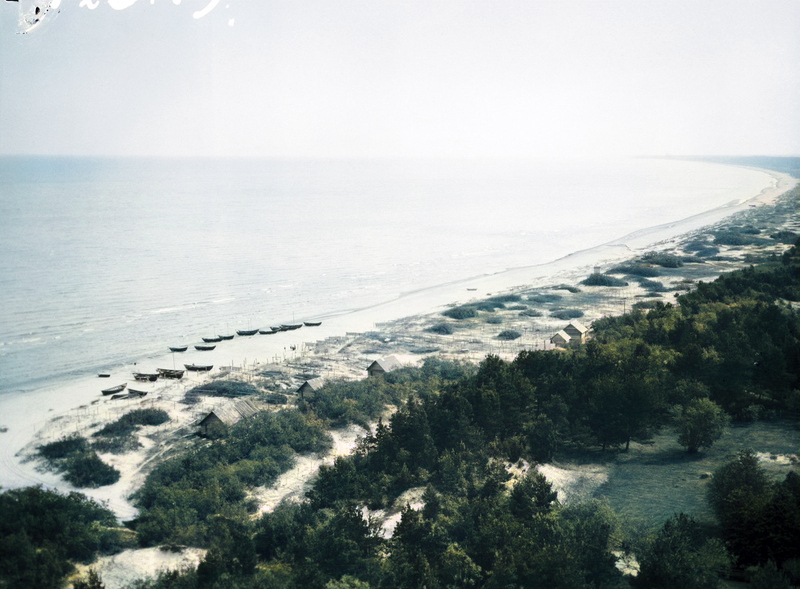

*View from the Pizā lighthouse. Photo by Vilho Setälä, 1912, colorized using a model by [DeepAI](https://deepai.org). Licence: CC BY 4.0. [More info at finna.fi](https://finna.fi/Record/museovirasto.871088232A502183E53A693C30CF078E).*

# Colorized Livonian Coast

This repository contains a collection of automatically 'colorized' historical photographs
of the [Livonian Coast](https://en.wikipedia.org/wiki/Livonian_Coast) (Līvõd Rānda).
The original photos were taken in the villages of the Livonian Coast by Finnish
photographer [Vilho Setälä](https://fi.wikipedia.org/wiki/Vilho_Set%C3%A4l%C3%A4) in 1912.
They are included in the [Finno-Ugric Picture collection](https://www.museovirasto.fi/en/collection-and-information-services/the_picture_collections/collections/finno-ugric-picture-collection)
of the [Finnish Heritage Agency's](https://www.museovirasto.fi/en/) and made available
through the [Finna.fi service](https://finna.fi) ([query for this specific set](https://finna.fi/Search/Results?filter%5B%5D=%7Eformat_ext_str_mv%3A%220%2FImage%2F%22&filter%5B%5D=%7Etopic_facet%3A%22liivil%C3%A4iset%22&lookfor=Set%C3%A4l%C3%A4%2C+Vilho&type=Author)).

Colorization of these images was carried out automatically using the 'colorizer' model
provided by [DeepAI](https://deepai.org/machine-learning-model/colorizer). This is an
automated, artificial intelligence based approach. Note that in the end all the model can
do is make an 'educated guess' regarding the actual colour of the objects in an image.
Often the results are quite convincing, but also fairly often they are obviously not
'accurate'. The aim of colorizing these images is merely to try and bring them to life,
and give an impression of what the scenes *may* have looked like. **The goal 
explicitly was not an attempt to accurately reconstruct what these scenes looked
like in reality**.

The images can be found in the [images](./images) folder. A [metadata file](./metadata.tsv)
has links to the original, high quality black-and-white image as well as the title
of each of the photos retrieved from the finna.fi services. 

[**Browse the image gallery**](./Gallery.md)

The black-and-white originals and more information about individual photos can be found
via the [finna.fi result browser](https://finna.fi/Search/Results?filter%5B%5D=%7Eformat_ext_str_mv%3A%220%2FImage%2F%22&filter%5B%5D=%7Etopic_facet%3A%22liivil%C3%A4iset%22&lookfor=Set%C3%A4l%C3%A4%2C+Vilho&type=Author).


You can also [download this repository including all images as a .zip file](https://github.com/twagoo/colorized-livonian-coast/archive/main.zip).

## Licence
The photos have all been published under a [CC BY 4.0 license](http://creativecommons.org/licenses/by/4.0/deed.en).
Therefore anyone is free to share and adapt these images under the condition of
attribution, and that no further restrictions are imposed.

## Links
- Livonians:
  - [Livones.net](https://www.livones.net)
  - [Virtual Livonia](http://www.virtuallivonia.info)
- [Finno-Ugric Picture collection](https://www.museovirasto.fi/en/collection-and-information-services/the_picture_collections/collections/finno-ugric-picture-collection)
  - [Original photos from the Livonian Coast villages by Vilho Setälä](https://finna.fi/Search/Results?filter%5B%5D=%7Eformat_ext_str_mv%3A%220%2FImage%2F%22&filter%5B%5D=%7Etopic_facet%3A%22liivil%C3%A4iset%22&lookfor=Set%C3%A4l%C3%A4%2C+Vilho&type=Author)
- [DeepAI](https://deepai.org/)
  - [Models](https://deepai.org/apis)


## Generation script

Included in this repository is a script to (re)generate the colorized images, making use
of the [finna.fi API](https://api.finna.fi) and the
[DeepAI API](https://deepai.org/machine-learning-model/colorizer).

### Usage

First, create a free account at [https://deepai.org](https://deepai.org) and find your
personal API key in your profile page. Then run the following

```sh
export DEEPAI_KEY="mykey" # your personal key here
bash generate.sh
```

After a few minutes of processing, the result should be a populated [images](./images)
directory as well as a [metadata.csv](./metadata.csv) file.
